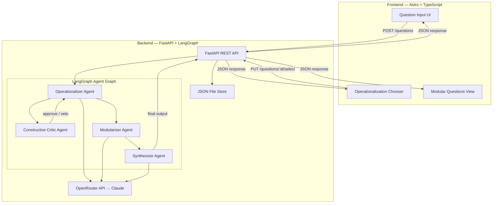
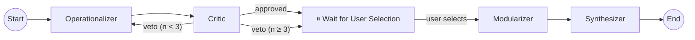

# Minokane — Ambient Superforecasting MVP

An automated forecasting system that takes natural-language questions, operationalizes them into precise forecast-ready forms, and decomposes them into modular sub-questions — powered by a multi-agent LLM pipeline.

**Reference:** [Forethought — Tools for Strategic Awareness](https://www.forethought.org/research/design-sketches-tools-for-strategic-awareness)

---

## User Review Required

> **`global_style.css` Access Needed.** Use `global_style.css` for fonts and colors.

> **Create a new Conda.** (`conda create -n minokane`). I've included installation links in the [Software Requirements](#software-requirements) section.

> [!IMPORTANT]
> **LLM Choice Clarification.** Use **Anthropic's Claude model** (preferred the latest Claude Opus version for the main persona managing all the others. The other ones should be Sonnet via OpenRouter) as the LLM for the agent pipeline.

---

## Open Questions

1. **OpenRouter API Key** — I do not have an OpenRouter account yet. You should instead create the harness/scaffolding. I'll verify things later. But you should create a placeholder error handler in our test suite.
2. **Port Preferences** — Use default ports backend (default: `8000`) and frontend dev server (default: `4321`)?
4. **Authentication** — Use a simple API key header for the FastAPI routes.

---

## Software Requirements

| Tool | Required Version | Check Command | Install Docs |
|------|-----------------|---------------|--------------|
| Python | 3.12+ | `python3 --version` | [python.org](https://www.python.org/downloads/) |
| Conda (Anaconda/Miniconda) | Latest | `conda --version` | [Miniconda Install](https://docs.anaconda.com/miniconda/install/) |
| Node.js | v22.12+ | `node --version` | [nodejs.org](https://nodejs.org/) |
| npm | 10+ | `npm --version` | Bundled with Node.js |
| Git | 2.30+ | `git --version` | [git-scm.com](https://git-scm.com/) |

### Environment Setup Commands (after install)

```bash
# 1. Create conda environment
conda create -n minokane python=3.12 -y
conda activate minokane

# 2. Verify
python --version   # → 3.12.x
node --version     # → v22.x or v25.x
npm --version      # → 10.x or 11.x
```

---

## Proposed Changes

### Architecture Overview



### Directory Structure

```
/Users/msr/msr/minokane/
├── backend/
│   ├── app/
│   │   ├── __init__.py
│   │   ├── main.py                    # FastAPI app, CORS, lifespan
│   │   ├── config.py                  # Pydantic Settings (env vars)
│   │   ├── routes/
│   │   │   ├── __init__.py
│   │   │   └── questions.py           # /questions endpoints
│   │   ├── models/
│   │   │   ├── __init__.py
│   │   │   └── schemas.py             # Pydantic request/response models
│   │   ├── agents/
│   │   │   ├── __init__.py
│   │   │   ├── graph.py               # LangGraph StateGraph definition
│   │   │   ├── state.py               # TypedDict state schema
│   │   │   └── personas/
│   │   │       ├── __init__.py
│   │   │       ├── operationalizer.py # Operationalizer Agent
│   │   │       ├── critic.py          # Constructive Critic Agent
│   │   │       ├── modularizer.py     # Modularizer Agent
│   │   │       └── synthesizer.py     # Synthesizer Agent
│   │   └── storage/
│   │       ├── __init__.py
│   │       └── json_store.py          # JSON file read/write
│   ├── data/
│   │   └── questions.json             # Persisted forecast data (overwrite)
│   ├── tests/
│   │   ├── __init__.py
│   │   ├── test_routes.py
│   │   └── test_agents.py
│   ├── requirements.txt
│   └── environment.yml                # Conda environment spec
├── frontend/
│   ├── src/
│   │   ├── layouts/
│   │   │   └── Layout.astro           # Base HTML layout
│   │   ├── pages/
│   │   │   └── index.astro            # Main page
│   │   ├── components/
│   │   │   ├── QuestionInput.astro    # Text box + deadline fields
│   │   │   ├── OperationalizationChooser.astro
│   │   │   ├── ModularQuestionsView.astro
│   │   │   └── LoadingSpinner.astro
│   │   ├── scripts/
│   │   │   └── api.ts                 # Fetch wrapper for backend
│   │   └── styles/
│   │       └── global.css             # Kokoro-style tokens (placeholder)
│   ├── public/
│   │   └── favicon.svg
│   ├── astro.config.mjs
│   ├── tsconfig.json
│   └── package.json
├── implementation_plan.md             # This file
├── prd_v0.md
├── resources.md
├── README.md                          # Updated with setup & run instructions
└── .env.example                       # Template for env vars
```

---

### Component 1: Backend — Python / FastAPI / LangGraph

#### [NEW] [environment.yml](/Users/msr/msr/minokane/backend/environment.yml)

Conda environment specification targeting Python 3.12 with pip dependencies:

```yaml
name: minokane
channels:
  - defaults
  - conda-forge
dependencies:
  - python=3.12
  - pip
  - pip:
      - fastapi>=0.115.0
      - uvicorn[standard]>=0.34.0
      - langgraph>=0.2.0
      - langchain-core>=0.3.0
      - langchain-openai>=0.3.0
      - pydantic>=2.10.0
      - pydantic-settings>=2.7.0
      - httpx>=0.28.0
      - python-dotenv>=1.1.0
      - pytest>=8.0.0
      - pytest-asyncio>=0.25.0
```

---

#### [NEW] [config.py](/Users/msr/msr/minokane/backend/app/config.py)

Pydantic Settings class loading from `.env`:

| Variable | Description | Default |
|----------|-------------|---------|
| `OPENROUTER_API_KEY` | API key for OpenRouter | *required* |
| `OPENROUTER_BASE_URL` | OpenRouter endpoint | `https://openrouter.ai/api/v1` |
| `LLM_MODEL` | Model identifier | `anthropic/claude-3.7-sonnet` |
| `DATA_FILE_PATH` | Path to JSON store | `./data/questions.json` |
| `LLM_TEMPERATURE` | Generation temperature | `0.7` |
| `LLM_MAX_TOKENS` | Max response tokens | `4096` |

---

#### [NEW] [schemas.py](/Users/msr/msr/minokane/backend/app/models/schemas.py)

Pydantic models mirroring the PRD data model:

```python
class QuestionInput(BaseModel):
    """User's raw natural-language question."""
    raw_question: str
    deadline: datetime | None = None         # Optional deadline
    outcome_description: str | None = None   # Optional outcome field

class OperationalizedQuestion(BaseModel):
    """A formal, resolvable version of the user's question."""
    id: str                                  # uuid4
    text: str                                # The operationalized question text
    resolution_criteria: str                 # How this resolves (unambiguous)
    resolution_source: str                   # Authoritative data source
    deadline: datetime                       # Exact resolution deadline (with tz)
    outcome_options: list[str]               # Mutually exclusive options
    void_conditions: str                     # What invalidates the question

class ModularSubQuestion(BaseModel):
    """A decomposed sub-question addressing part of the parent."""
    id: str
    parent_id: str                           # Links to OperationalizedQuestion
    text: str
    explanation: str                         # Short explanation of relevance
    domain_tag: str                          # e.g. "geopolitics", "economics"
    confidence_of_importance: Literal["high", "medium", "low"]
    llm_baseline_likelihood: Literal["high", "medium", "low"]

class ForecastSession(BaseModel):
    """Top-level session object persisted to JSON."""
    id: str
    created_at: datetime
    original_question: QuestionInput
    operationalized_options: list[OperationalizedQuestion]
    selected_operationalization_id: str | None = None
    modular_sub_questions: list[ModularSubQuestion] = []
    status: Literal["intake", "operationalizing", "selecting", "modularizing", "complete"]
```

---

#### [NEW] [state.py](/Users/msr/msr/minokane/backend/app/agents/state.py)

LangGraph `TypedDict` state flowing through the graph:

```python
class ForecastState(TypedDict):
    raw_question: str
    deadline: str | None
    outcome_description: str | None
    operationalized_options: list[dict]      # List of OperationalizedQuestion dicts
    critic_feedback: str | None              # Critic's assessment
    critic_approved: bool                    # Veto gate
    revision_count: int                      # Track revision loops (max 3)
    selected_option: dict | None             # User's chosen operationalization
    modular_sub_questions: list[dict]        # Decomposed sub-questions
    final_summary: str | None               # Synthesizer output
    messages: Annotated[list, add_messages]  # LangGraph message accumulator
```

---

#### [NEW] Agent Personas (4 files in `/Users/msr/msr/minokane/backend/app/agents/personas/`)

Each agent is a LangGraph node function with a detailed system prompt:

| # | Agent File | Persona | Role |
|---|-----------|---------|------|
| 1 | `operationalizer.py` | **Dr. Mira Chen — The Operationalizer** | A meticulous research methodologist who transforms vague questions into precisely-scoped, resolvable forecasting questions. Enforces the four resolution criteria from the PRD. Generates 3–5 candidate operationalizations. |
| 2 | `critic.py` | **Marcus Webb — The Constructive Critic** | A skeptical devil's advocate with veto power. Reviews operationalizations for ambiguity, overlapping outcomes, weak void conditions, or unstated assumptions. Returns `approved` or `veto + specific revisions`. Max 3 revision rounds before escalating to user. |
| 3 | `modularizer.py` | **Dr. Anika Patel — The Modularizer** | An analytically-minded systems thinker who decomposes complex questions into independent, answerable sub-components. Tags each with domain, confidence-of-importance, and baseline likelihood. Skips modularization if the operationalized question is already atomic. |
| 4 | `synthesizer.py` | **James Harrington — The Executive Synthesizer** | A business executive who distills outputs into clear, concise, decision-relevant summaries. Strips jargon, highlights what matters, and frames uncertainty honestly. Produces the final output the user sees. |

---

#### [NEW] [graph.py](/Users/msr/msr/minokane/backend/app/agents/graph.py)

The LangGraph `StateGraph` wiring:



Key design decisions:
- **Human-in-the-loop pause** after operationalization so the user can pick or edit their preferred version. Implemented via LangGraph's interrupt/checkpoint mechanism — the graph serializes state and resumes when the user makes a selection via the API.
- **Critic veto loop** caps at 3 revisions to prevent infinite loops, then surfaces all options to the user anyway.
- **Conditional skip**: If the user's original question already contains clear resolution criteria, deadline, and outcome options, the Operationalizer detects this and passes through with minimal changes.

---

#### [NEW] [questions.py](/Users/msr/msr/minokane/backend/app/routes/questions.py)

REST API endpoints:

| Method | Path | Description |
|--------|------|-------------|
| `POST` | `/api/questions` | Submit a new natural-language question. Kicks off the LangGraph pipeline through operationalization + critic loop. Returns the session with candidate operationalizations. |
| `GET` | `/api/questions/{session_id}` | Retrieve a session's current state. |
| `PUT` | `/api/questions/{session_id}/select` | User selects (or edits) an operationalized question. Resumes the graph through modularization + synthesis. |
| `GET` | `/api/questions/{session_id}/result` | Retrieve the final modular sub-questions and synthesis. |

---

#### [NEW] [json_store.py](/Users/msr/msr/minokane/backend/app/storage/json_store.py)

Simple JSON file persistence. Per the PRD: "just overwrite the same file."

- Reads/writes to `/Users/msr/msr/minokane/backend/data/questions.json`
- Stores a single `ForecastSession` object (overwritten on each new question)
- Uses `json.dump` with `indent=2` for human readability
- Thread-safe via `asyncio.Lock`

---

#### [NEW] [main.py](/Users/msr/msr/minokane/backend/app/main.py)

FastAPI application entry point:
- CORS middleware configured for the Astro dev server (`http://localhost:4321`)
- Includes the `questions` router
- Lifespan handler initializes the JSON store file if missing
- Runs via `uvicorn app.main:app --reload --port 8000`

---

### Component 2: Frontend — Astro + TypeScript

#### [NEW] Astro Project Scaffold

Initialize via:
```bash
npm create astro@latest ./  # In /Users/msr/msr/minokane/frontend/
# Options: Empty template, TypeScript strict, install deps, no git (already have repo root)
```

---

#### [EXISTING] [global.css](/Users/msr/msr/minokane/frontend/src/styles/global.css)

Use design inspired by the kokoro-website aesthetic. Includes:
- Dark mode color palette (deep navy/charcoal base, blue accent `#4A90D9`)
- Typography: Inter font family from Google Fonts
- Spacing scale, border-radius tokens
- Subtle transition defaults for interactive elements

---

#### [NEW] [QuestionInput.astro](/Users/msr/msr/minokane/frontend/src/components/QuestionInput.astro)

The main input component:
- Large, prominent `<textarea>` for the natural-language question
- Optional "Deadline" date-time picker field
- Optional "Expected Outcome" text field
- Submit button triggers `POST /api/questions`
- Clean, minimal design per UX principles
- Loading state while the agent pipeline runs

---

#### [NEW] [OperationalizationChooser.astro](/Users/msr/msr/minokane/frontend/src/components/OperationalizationChooser.astro)

Displays the 3–5 candidate operationalizations returned by the backend:
- Radio-button selector for each option
- Each option rendered as a card showing:
  - The operationalized question text
  - Resolution criteria (editable inline)
  - Deadline (editable via dropdown with sensible pre-selected options: 1 month, 3 months, 6 months, 1 year, custom)
  - Outcome options
  - Void conditions
- "Confirm Selection" button triggers `PUT /api/questions/:id/select`
- Inline edit capability for any field before confirming

---

#### [NEW] [ModularQuestionsView.astro](/Users/msr/msr/minokane/frontend/src/components/ModularQuestionsView.astro)

Displays the final output:
- Selected operationalized question at the top
- List of modular sub-questions, each showing:
  - Question text
  - Short explanation
  - Domain tag (styled badge)
  - Confidence of importance (color-coded: high=green, medium=amber, low=grey)
  - LLM baseline likelihood (color-coded similarly)
- Executive summary from the Synthesizer at the bottom
- Concise, decision-relevant tone

---

#### [NEW] [api.ts](/Users/msr/msr/minokane/frontend/src/scripts/api.ts)

TypeScript fetch wrapper:
- `submitQuestion(input)` → `POST /api/questions`
- `getSession(id)` → `GET /api/questions/{id}`
- `selectOperationalization(id, selection)` → `PUT /api/questions/{id}/select`
- `getResult(id)` → `GET /api/questions/{id}/result`
- Typed request/response interfaces matching the backend Pydantic schemas
- Error handling with user-friendly messages

---

#### [NEW] [index.astro](/Users/msr/msr/minokane/frontend/src/pages/index.astro)

Single-page application flow:
1. **Step 1 — Ask:** Shows `QuestionInput`
2. **Step 2 — Choose:** Shows `OperationalizationChooser` (after submission)
3. **Step 3 — Review:** Shows `ModularQuestionsView` (after selection)

Client-side state management via vanilla TypeScript (no framework needed for MVP). Steps transition with CSS fade animations.

---

### Component 3: Project Configuration

#### [MODIFY] [README.md](/Users/msr/msr/minokane/README.md)

Complete rewrite with:
- Project description and link to the PRD
- Software requirements table (from above)
- Step-by-step setup instructions (conda env, npm install)
- How to run (backend + frontend dev servers)
- How to test (`pytest`, `astro check`)
- Environment variables reference

#### [NEW] [.env.example](/Users/msr/msr/minokane/.env.example)

Template:
```env
OPENROUTER_API_KEY=your-key-here
OPENROUTER_BASE_URL=https://openrouter.ai/api/v1
LLM_MODEL=anthropic/claude-3.7-sonnet
LLM_TEMPERATURE=0.7
LLM_MAX_TOKENS=4096
DATA_FILE_PATH=./data/questions.json
```

#### [MODIFY] [.gitignore](/Users/msr/msr/minokane/.gitignore)

Add entries for:
```
.env
node_modules/
frontend/dist/
backend/data/questions.json
```

---

## Build Order (Phased Execution)

### Phase 1 — Scaffolding & Config
1. Install Conda (user action) and create `minokane` environment
2. Initialize backend directory structure with `environment.yml`, `requirements.txt`
3. Create `config.py`, `.env.example`
4. Initialize Astro frontend project
5. Create `global.css` placeholder
6. Update `README.md` and `.gitignore`

### Phase 2 — Backend Core
7. Implement `schemas.py` (Pydantic models)
8. Implement `json_store.py` (JSON persistence)
9. Implement `main.py` (FastAPI app skeleton)
10. Implement `routes/questions.py` (API endpoints, stubbed responses)

### Phase 3 — Agent Pipeline
11. Implement `state.py` (LangGraph state)
12. Implement all 4 persona agents (`operationalizer.py`, `critic.py`, `modularizer.py`, `synthesizer.py`)
13. Implement `graph.py` (wire the LangGraph StateGraph with conditional edges and human-in-the-loop pause)
14. Connect agents to the API routes

### Phase 4 — Frontend
15. Build `QuestionInput.astro`
16. Build `OperationalizationChooser.astro`
17. Build `ModularQuestionsView.astro`
18. Build `api.ts` and wire everything in `index.astro`

### Phase 5 — Polish & Verify
19. End-to-end testing with a real question
20. Write unit tests for routes and agent logic
21. Final UX polish and CSS refinement

---

## Verification Plan

### Automated Tests

```bash
# Backend unit tests
cd /Users/msr/msr/minokane/backend
conda activate minokane
pytest tests/ -v

# Frontend type checking
cd /Users/msr/msr/minokane/frontend
npm run astro check

# API smoke test
curl -X POST http://localhost:8000/api/questions \
  -H "Content-Type: application/json" \
  -d '{"raw_question": "Will the Fed cut rates by December 2026?"}'
```

### Manual Verification
- **End-to-end flow:** Submit a question in the Astro UI → observe operationalizations → select one → review modular sub-questions and synthesis
- **Edge cases:** Test with a question that's already fully operationalized (should skip or minimally modify)
- **Error handling:** Test with an invalid API key, empty question, malformed input
- **JSON overwrite behavior:** Confirm `questions.json` is overwritten (not appended) per PRD spec
- **Browser validation:** Use the Antigravity browser tool to interact with the frontend and verify the full flow visually
