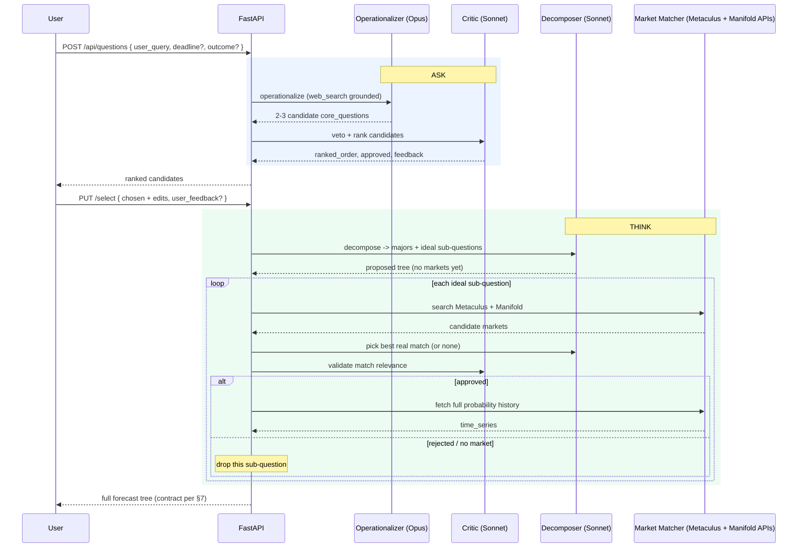

# PRD — Ask & Think (Minokane)

**Product:** Minokane — Ambient Superforecasting
**Scope of this doc:** The **Ask** and **Think** stages of the pipeline.
**Status:** Ready for engineering.
**Supersedes for these stages:** the relevant portions of [`prd_v0.md`](prd_v0.md). Where this doc and `prd_v0.md` conflict, this doc wins for Ask/Think.
**Related artifacts:** the canonical output contract lives at `/Users/msr/msr/minokane/backend/data/sample_forecast_data.json` (sample/fake data, same shape Think must emit).

---

## 1. Summary

Minokane turns a fuzzy natural-language forecasting question into a precise, resolvable question and decomposes it into a tree of **real prediction markets**. This document specifies the first two stages:

- **Ask** — take the user's raw `user_query`, operationalize it into 2–3 candidate `core_question`s, let the user pick and edit one.
- **Think** — decompose the chosen `core_question` into `major_category_components`, and bind every leaf to a **real Metaculus or Manifold market** (question, URL, and full probability `time_series`).

The output of Think is the complete forecast tree that the **Show** stage renders. Show, its visualizations, and the executive-summary synthesizer are **out of scope** here (see §12).

---

## 2. Goals & non-goals

### Goals
- Reliably restate a vague question as a well-formed, resolvable `core_question` (per the resolution-criteria rules in §5.2).
- Decompose the `core_question` into a shallow tree whose **every leaf is a real, live prediction market** on Metaculus or Manifold.
- Return each market's identity **and** its full historical probability `time_series` in one payload.
- Be honest about coverage: never invent a market, never synthesize a probability series.

### Non-goals (this doc)
- The **Show** UI and any visualization (owned by frontend — treemap/list/tiles are their call).
- The **Synthesizer** / executive summary (James Harrington) — deferred to Show.
- Numeric / multiple-choice / date markets — **binary Yes/No only** for MVP.
- Platforms beyond **Metaculus** and **Manifold**.
- A real database — persistence stays a JSON store (overwrite), per `prd_v0.md`.
- LLM-synthesized or "baseline" probability series — **explicitly excluded** (real markets only).

---

## 3. Glossary & data model

| Term | Meaning |
|---|---|
| `user_query` | The raw, natural-language question the user typed. (Stored as `raw_question` in the payload.) |
| `core_question` | The operationalized, resolvable version the user selected in Ask. |
| **Ask candidate** | One of 2–3 operationalization options the user chooses among. |
| `major_category_component` | A top-level branch of the `core_question`. Either a **rollup** (has children) or an **atomic market** (no children — see §6.4). |
| `minor_category_component` | A child of a major. **Always** a real prediction market. |
| **Market node** | Any node with **no children** — always backed by a real market (`market_url` + `time_series`). Every leaf is a market node. |
| **Rollup node** | Any node **with** children — a conceptual grouping, never itself a market. |

> **Naming note (confirm):** the concrete JSON uses a single recursive `components[]` array with a `type` discriminator (`"major_category"` / `"minor_category"`), matching `sample_forecast_data.json`. In this doc, `major_category_components` = the top-level `components[]`; `minor_category_components` = a major's nested `components[]`. If engineering prefers two explicitly named arrays instead, flag it — this is the one open naming question (§13).

---

## 4. End-to-end flow



---

## 5. The **Ask** stage

> Largely implemented today (Operationalizer + Critic + chooser). This section pins the required behavior; deltas from current code are called out.

### 5.1 Input
`POST /api/questions`
```json
{ "user_query": "Is AI going to change tech in a big way soon?",
  "deadline": "2027-12-31T23:59:59Z",   // optional pre-fill
  "outcome_description": null }          // optional pre-fill
```

### 5.2 Operationalizer (Dr. Mira Chen — Claude Opus)
Produces **2–3** candidate `core_question`s. Each candidate MUST satisfy the four resolution rules (carried from `prd_v0.md`):

1. **Unambiguous resolution criteria** — one authoritative source, no interpretation room.
2. **Precise timeframe** — an exact deadline (date, time, zone).
3. **Mutually exclusive & exhaustive outcomes** — binary preferred.
4. **Clear void conditions** — what cancels the forecast.

- **Grounding:** Anthropic native `web_search` server tool stays **ON** (env-gated, default on) for current-fact grounding. *(Assumption — confirm.)*
- **Outcome type:** MVP emits **binary** candidates. (`outcome_type` field retained for forward-compat; non-binary deferred.)

**Per-candidate schema:** `id, text, resolution_criteria, resolution_source, deadline, outcome_type, outcome_options, outcome_unit, void_conditions`.

### 5.3 Critic — Ask role (Marcus Webb — Claude Sonnet)
- Vetoes candidates that fail the §5.2 rules; **max 3 revision rounds** with Mira.
- Ranks the approved candidates by closeness to the user's original intent (`ranked_order`).
- Returns `{ approved, feedback, ranked_order }`.

### 5.4 User selection & editing
- Frontend shows candidates in ranked order; user selects one and may edit any field (resolution criteria, source, deadline, outcome, void conditions) inline.
- User may attach an optional free-text `user_feedback` string at confirm time (threaded into Think).
- **Already-precise input:** if the `user_query` is already a well-formed resolvable question, Mira may return it (near-)verbatim as one candidate; the user can still confirm/edit. (No hard "skip Ask" path in MVP.)

### 5.5 Ask acceptance criteria
- Every candidate carries all nine fields and passes the four resolution rules.
- 2–3 candidates returned within the Critic's 3-round budget; if none pass, return best-effort candidates flagged `approved:false` with Critic feedback (never hard-fail the user).
- User edits are persisted on the session and are the source of truth handed to Think.

---

## 6. The **Think** stage

Triggered by `PUT /api/questions/{id}/select`. Input: the selected+edited `core_question` and optional `user_feedback`.

### 6.1 Decompose (Dr. Anika Patel — Claude Sonnet)
- Breaks `core_question` into **~3–5 major branches** *(assumption — confirm bounds)*.
- For each major, proposes **0–4 ideal sub-questions** — the questions we'd *want* markets for. These are drafts, not yet markets.
- Incorporates the user's confirm-time `user_feedback`.
- Tags every proposed node: `domain_tag`, `confidence_of_importance ∈ {high,medium,low}`, `llm_baseline_likelihood ∈ {high,medium,low}`.

### 6.2 Market matching — *Decompose → API search → LLM picks*
For **each ideal sub-question** (and each atomic-major candidate, §6.4):

1. **Search** both Metaculus and Manifold for candidate markets (see §9). Filter to **binary** markets that are **open/live** (not deleted; resolved allowed but flagged — §6.6).
2. **LLM picks** (Anika, lightweight pass): choose the single best real market from the candidates, or return **no-match**. On a pick, the node **adopts the market's canonical question text and URL** (not the LLM's drafted wording).
3. **Validate** (Marcus, §6.3) that the chosen market genuinely answers the sub-question.
4. On approval, **fetch the full probability history inline** (§6.5) and attach it.
5. On no-match or rejection → **drop the sub-question** (real-markets-only; no fallback).

**Ordering rationale:** validate *before* the expensive history fetch, so we only pull series for markets that survive the relevance check.

**Dedupe:** a given market may match multiple sub-questions; it appears **once** in the tree (first/highest-importance placement wins).

### 6.3 Critic — Think role (Marcus Webb)
- For each candidate match, judges relevance: does this market's resolution actually inform the sub-question? Returns accept / reject + reason.
- Reject → matcher may try the next-best candidate once, else the sub-question is dropped.
- A cheap, text-only pass (uses the sub-question text + the market's question/description; no series needed).

### 6.4 Atomic leaf majors
A `major_category_component` **may or may not** have minor children:
- **Has minors** → it is a **rollup** (no market fields; no series).
- **No minors** → it **is itself a single prediction market** (atomic): it carries `market_url`, `source`, `outcome_options`, and `time_series`, exactly like a minor. Used when one market answers the whole major.

**Invariant:** every **leaf** node in the tree is a real market node. A rollup with zero surviving market children is **dropped** (see §6.7).

### 6.5 Inline `time_series` fetch
- For every market node, fetch the market's **full historical probability series** at Think time and embed it in the response.
- **Normalize** across platforms to `[{ "date": "YYYY-MM-DD", "probability": <0–100> }]`, where `probability` = P(Yes) as a percent, rounded to 1 decimal.
- **Cadence:** resample to **weekly** points over the market's available history *(assumption — matches the sample; confirm vs. full-resolution)*.
- Latency/cost of inline fetch is real (≤ ~20 markets × search+history) — see mitigations in §11.

### 6.6 Market status
Each market node carries a `status ∈ {open, resolved, closed}`. Resolved/closed markets are allowed (their history is informative) but must be flagged so Show can style them.

### 6.7 No-coverage handling
- A sub-question with no acceptable market → dropped.
- A major with no surviving market children (and not itself an atomic market) → dropped.
- The **entire `core_question` with zero markets** → return an empty `components: []` with an explicit `coverage` object (§7) and an honest "no live markets found" signal. Never fabricate to fill space.

### 6.8 Think acceptance criteria
- **100%** of shipped leaves have a real `market_url` that resolves (HTTP 200, not deleted) and a non-empty `time_series`.
- No node contains a synthesized/estimated series.
- Every market's `source ∈ {metaculus, manifold}` and `outcome_options == ["Yes","No"]`.
- Response includes a `coverage` summary (how many proposed sub-questions found markets).

---

## 7. Output data contract

Canonical shape = `/Users/msr/msr/minokane/backend/data/sample_forecast_data.json`, with the additions below (`status`, `market_id`, `coverage`, and market fields permitted on atomic majors).

```jsonc
{
  "id": "uuid",
  "raw_question": "…user_query…",
  "core_question": "…operationalized, user-selected…",
  "created_at": "2026-07-18T00:00:00Z",
  "user_feedback": null,
  "coverage": { "sub_questions_proposed": 12, "markets_found": 9, "branches_dropped": 1 },
  "components": [
    {
      "id": "uuid",
      "type": "major_category",
      "component": "…rollup question…",
      "domain_tag": "technology",
      "confidence_of_importance": "high",
      "components": [
        {
          "id": "uuid",
          "type": "minor_category",
          "component": "…market's canonical question…",
          "domain_tag": "technology",
          "confidence_of_importance": "high",
          "llm_baseline_likelihood": "medium",
          "source": "metaculus",              // metaculus | manifold
          "market_id": "…platform id…",
          "market_url": "https://…",
          "status": "open",                    // open | resolved | closed
          "outcome_options": ["Yes", "No"],
          "time_series": [ { "date": "2026-01-05", "probability": 55.2 } ]
        }
      ]
    },
    {
      "id": "uuid",
      "type": "major_category",
      "component": "…question one market answers directly…",
      "domain_tag": "economics",
      "confidence_of_importance": "high",
      "llm_baseline_likelihood": "high",
      "source": "manifold",                    // ATOMIC major: carries market fields,
      "market_id": "…",                         // no `components` array
      "market_url": "https://manifold.markets/…",
      "status": "open",
      "outcome_options": ["Yes", "No"],
      "time_series": [ { "date": "2026-01-05", "probability": 61.0 } ]
    }
  ]
}
```

**Rule of thumb for consumers:** a node is a **market** iff it has no `components` array (or an empty one); otherwise it's a rollup.

---

## 8. API surface

Existing routes are reused; the change is *what Think does* on `/select`. All routes require the `X-API-Key` header.

| Method | Path | Ask/Think | Behavior |
|---|---|---|---|
| `POST` | `/api/questions` | Ask | Run Operationalizer + Critic → return session id + ranked candidates. |
| `GET` | `/api/questions/{id}` | — | Session state. |
| `PUT` | `/api/questions/{id}/select` | Think | Persist selected+edited `core_question` (+ `user_feedback`) → run decompose + match + validate + inline series → return full tree. |
| `GET` | `/api/questions/{id}/result` | — | Completed tree. |
| `GET` | `/health` | — | Health check. |

> The current `/select` also runs the Synthesizer (James). For this scope, `/select` ends at the Think tree; the summary is deferred to Show (§12). Engineering may leave James wired but out of the critical path, or move it — flag preference.

---

## 9. External integrations (Metaculus + Manifold)

> Endpoints below are directional; **engineering to confirm exact paths, auth, pagination, and rate limits** against live docs before build (see §13).

**Manifold** (public REST, no key for reads):
- Search: `GET https://api.manifold.markets/v0/search-markets?term=<q>&filter=open&contractType=BINARY`
- Market: `GET https://api.manifold.markets/v0/market/{id}` → `probability`, `url`, `question`, `outcomeType`, `isResolved`.
- History: reconstruct series from bets (`GET /v0/bets?contractId={id}` → `probAfter` over `createdTime`). Internal prob is 0–1 → ×100.

**Metaculus** (public read API):
- Search: `GET https://www.metaculus.com/api2/questions/?search=<q>&type=forecast` (filter to binary).
- Detail: question object exposes the community-prediction history for binary questions (0–1 → ×100).

**Common requirements:**
- Filter to **binary** only; drop multiple-choice/numeric/date for MVP.
- Verify the `market_url` is live (HTTP 200, not deleted) before shipping the node.
- Normalize both sources to the §6.5 series shape.
- Cache market search + history responses (TTL) to cut latency/cost and respect rate limits.
- Concurrency: fan out searches/fetches with a bounded async pool + per-call timeout.

---

## 10. Personas (updated roster)

| Persona | Stage | Role | Model | Notes |
|---|---|---|---|---|
| **Dr. Mira Chen** | Ask | Operationalizer — 2–3 candidates | Claude Opus | `web_search` grounded. |
| **Marcus Webb** | Ask **+** Think | Critic — rank candidates (Ask); validate each market match (Think) | Claude Sonnet | **Dual role** — new Think responsibility. |
| **Dr. Anika Patel** | Think | Decomposer — majors + ideal sub-questions; picks best real market from search candidates | Claude Sonnet | Two passes: decompose, then per-candidate pick. |
| *Market Matcher* | Think | Deterministic service — search Metaculus + Manifold, fetch/normalize series | — | Non-LLM integration layer (§9). |
| *James Harrington* | (Show) | Synthesizer — executive summary | Claude Sonnet | **Out of scope** here. |

---

## 11. Risks & mitigations

| Risk | Mitigation |
|---|---|
| **False trust** from polished output (`prd_v0` risk) | Only ship real markets; show the market's own question + source link so users can verify; no synthesized series. |
| **Thin coverage** (real-markets-only cliff) | Honest empty/partial states + `coverage` object; drop rather than fabricate. |
| **Wrong market matched** | Marcus relevance validation + a match-score threshold + surfacing the market's canonical question so users can sanity-check. |
| **Latency/cost** of inline series fetch | Bounded async concurrency, per-call timeouts, response caching, and hard caps (~5 majors × ~4 markets). Consider a partial-result stream if P95 is too high. |
| **Dead / deleted URLs** | Liveness check (HTTP 200) before shipping any node. |
| **API rate limits / downtime** | Retries w/ backoff, cache, graceful degradation to partial trees. |
| **Overconfident operationalization** | Critic veto + 3-round revision loop; expose resolution criteria for user edit. |

---

## 12. Out of scope (explicit)
- Show stage & all visualizations (frontend-owned).
- Executive-summary synthesis (James).
- Non-binary markets; platforms beyond Metaculus/Manifold.
- Real database; auth beyond the existing API-key header.
- Real-time series refresh after Think (series is a point-in-time snapshot; refresh is a later data-layer concern).

---

## 13. Open questions / assumptions to confirm
1. **Schema naming** — keep recursive `components[]` + `type`, or two explicit arrays `major_category_components` / `minor_category_components`? (Doc assumes the former, matching the sample file.)
2. **Tree bounds** — is ~3–5 majors × ≤4 markets right?
3. **Series cadence** — weekly resample (assumed) vs. full-resolution history?
4. **Web-search grounding** — keep ON for the Operationalizer? (assumed yes)
5. **Synthesizer (James)** — leave wired after Think, or fully move to Show?
6. **Match-score threshold** — minimum acceptable match confidence before Marcus even reviews?

---

## 14. Success metrics
- **Coverage:** ≥ *[target]*% of user queries yield ≥1 market-backed leaf.
- **Integrity:** 100% of leaves have a live `market_url` + real `time_series`; 0 synthesized series.
- **Match quality:** ≥ *[target]*% of matches pass a manual relevance spot-check.
- **Ask quality:** 100% of candidates satisfy the four resolution rules.
- **Latency:** P50 / P95 for `POST /questions` (Ask) and `PUT /select` (Think) within *[targets]*.

*(Fill targets with engineering + product before build.)*

---

## 15. Implementation surface (guidance, not a plan)
Likely touchpoints in `/Users/msr/msr/minokane/backend/`:
- `app/agents/personas/` — extend Marcus (Think validation), add Anika's match-pick pass.
- `app/agents/graph.py`, `app/agents/state.py` — add match/validate/fetch nodes to the Think subgraph.
- `app/integrations/manifold.py`, `app/integrations/metaculus.py` — **new**: search + history + normalization.
- `app/services/market_matching.py` — **new**: orchestrates search → pick → validate → fetch → dedupe.
- `app/models/schemas.py` — add `status`, `market_id`, `source`, `coverage`; allow market fields on atomic majors.
- `app/routes/questions.py` — `/select` runs the new Think tree.
- `app/storage/json_store.py` — persist the new tree shape.

A detailed `implementation_plan.md` should follow once the §13 questions are settled.
